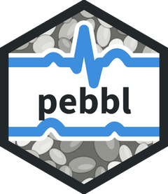

<p align="center"></p>

# PEBBL

**Physiology in the Emotion, Brain & Behavior Lab** (Tufts University).
*Please Eyeball Before Believing Labels.*

PEBBL is the lab's tool for checking physiological recordings by eye: ECG, finger pulse (PPG), breathing,
skin conductance and blood pressure. It shows each recording with a computer's marks on it (heartbeats, and
stretches that look unusable), and a trained reviewer corrects them. Two reviewers check each recording
independently, and a reconciler settles any disagreements.

## Research assistants: start here

Read the **[PEBBL user manual](https://tufts-ebbl.github.io/pebbl/)** (or
[download it as a PDF](https://tufts-ebbl.github.io/pebbl/PEBBL_User_Manual.pdf)). It covers setting up a
Windows or Mac computer (about 30 minutes, once) and reviewing each signal.

In short, after installing Python 3.11 and Git, and getting access to your data folder (our lab's is on Box):

```
cd ~
git clone https://github.com/tufts-ebbl/pebbl.git
```

then run **Set up PEBBL.bat** (Windows) or `bash ~/pebbl/setup_pebbl.sh` (Mac) once, and start PEBBL with
**Start PEBBL.bat** or **Start PEBBL.command**. PEBBL updates itself each time it starts.

## Lab staff: setting up a shared lab computer

One copy of PEBBL per Windows computer, for every user, with an icon on everyone's desktop. Open **Git Bash with
"Run as administrator"** and paste:

```
curl -fLO https://raw.githubusercontent.com/tufts-ebbl/pebbl/main/setup_lab_computer.sh && bash setup_lab_computer.sh
```

It installs Python 3.11 for all users if needed (after checking the installer's signature), downloads PEBBL to
`C:\Users\Public\Downloads\pebbl`, lets every user update it, builds its Python environment and adds the desktop
icon. It ends with a checklist. It's safe to run again. Add `--python-installer '\\server\share\python-3.11.x-amd64.exe'`
to install Python from your own copy (use the full network path, not a mapped drive letter), `--dry-run` to see what
it would do, or `--check` to check a computer without changing it.

## For developers

`DEVELOPER_README.md` documents the tool in detail: the command-line options, the review steps, the saved file
format and the test suites (`python test_<name>.py`). The tool reads the `*_physio.tsv.gz` files and their
JSON sidecars that the lab's processing pipeline writes. It never changes them; it writes reviewers' marks to
separate JSON files.

This repository holds code only. Participant data are never stored here.
